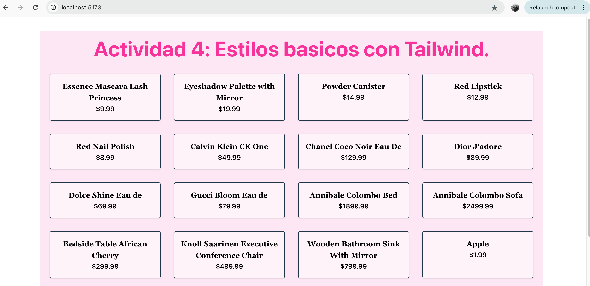

# Evidencia 1 - Proyecto Integrador

Configuración inicial de entorno **React + Vite + Tailwind + Axios.**

**Alumna:** Aguirre, Ana Luz.

**Materia:** Proyecto Integrador.

**Profesor:** Garcia, Hector.

ISPC

## Instrucciones:

**Paso 1:** Clonar este repositorio.

git clone https://github.com/AnaAguirre77/Evidencia1-ProyectoIntegrador.git

**Paso 2:** Entrar en la carpeta del proyecto.

cd Evidencia1-ProyectoIntegrador

**Paso 3:** Instalar las dependencias.

npm install

**Paso 4:** Iniciar el servidor de desarrollo.

npm run dev

**Paso 5:** Abrir en el navegador.
Link: http://localhost:5173

## Resultado en funcionamiento:

Muchas gracias!
